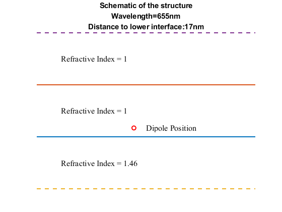
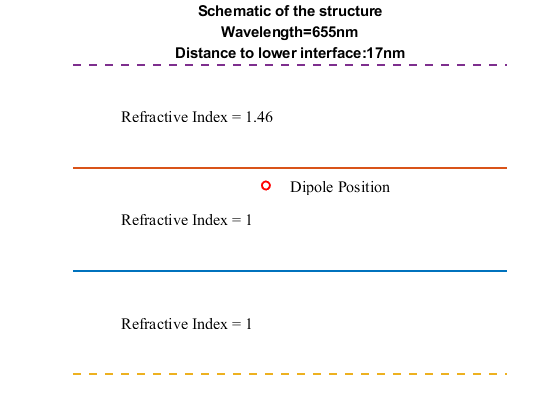
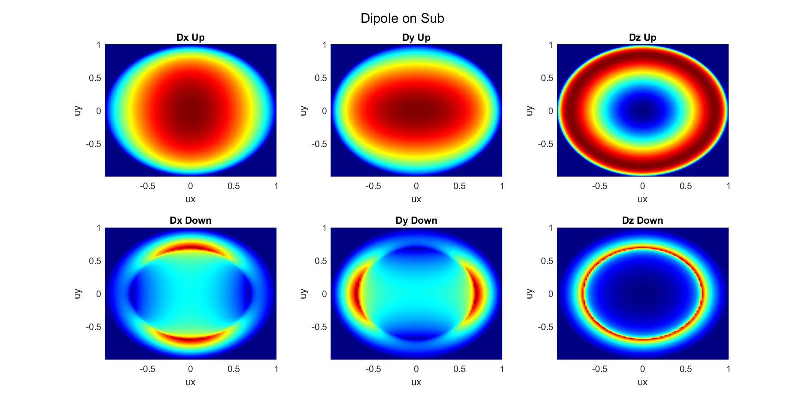
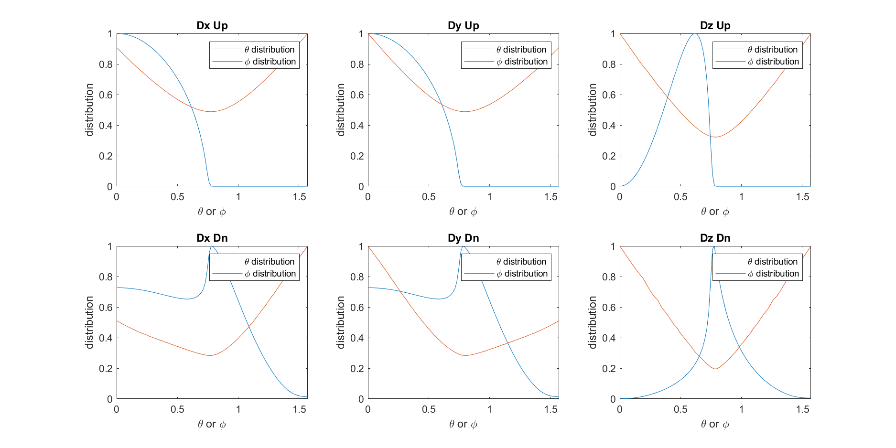

# Dipole Far Field Pattern in Stratified Media
An MATLAB version of dipole emission pattern in Multi-layered structure.

To calculate the far field pattern of dipole in stratified media. As is shown blew,

I use the method introduced in this paper

[[Accurate and efficient computation of the Green’s tensor for stratified media](https://link.aps.org/doi/10.1103/PhysRevE.62.5797)](https://link.aps.org/doi/10.1103/PhysRevE.62.5797)

and the corresponding note is in my personal blog

[Dipole's Emission In Multi-Layered Structure](https://knifelees3.github.io/2020/06/22/A_En_DipoleInMultiLayerCartesian/#Dyadic-Analysis)

## How to use

As an example, I calculate the dipole's emission near substrate. The structure should be set in the file `BasicStructureSet.m` and we can show the structure we set via the function `ShowStructure.m`. For this MATLAB version, I only write down the far field simulation in the upper directions and if you want to simulate the far field in the lower direction you should reverse the structure. I offer a function `StructureReSet.m` to reverse the structure.

The structure is shown blew.

and the reversed structure is as follows

The simulated far filed pattern for dx, dy, dz dipoles are as follows

we could also plot the $\rho,\phi$ distributions here

Some veriftications will be added soon
